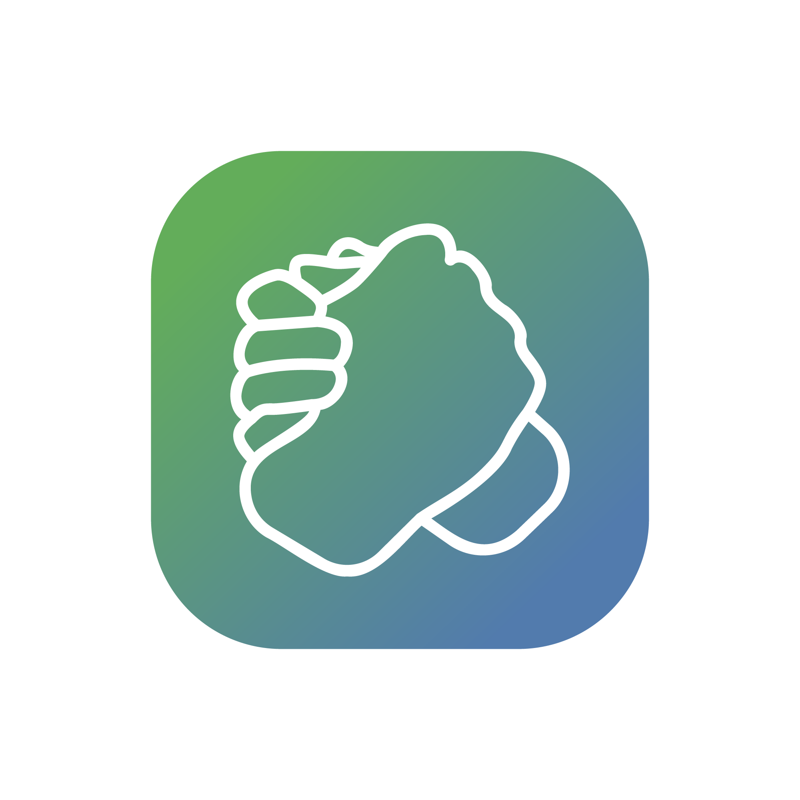

# Gively



Gively is a social donation app that connects users with charitable causes and enables a community-focused approach to giving. The platform allows users to discover charities, share their donations, follow friends, and interact in a social feed centered around charitable activities.

## Table of Contents

- [Overview](#overview)
- [Features](#features)
- [Tech Stack](#tech-stack)
- [Project Structure](#project-structure)
- [Getting Started](#getting-started)
- [Development Environment](#development-environment)
- [Firebase Setup](#firebase-setup)
- [Contributing](#contributing)
- [License](#license)

## Overview

Gively transforms charitable giving into a social experience. Users can see where their friends donate, discover new charities aligned with their interests, share petitions and fundraisers, coordinate volunteer opportunities, and track their personal donation history - all within a single application.

The app aims to make giving more accessible, social, and engaging, encouraging users to participate in charitable activities and connect with like-minded individuals around causes they care about.

## Features

### Authentication & Account Creation
- Email/password sign-in
- Multi-step account setup
- Profile customization
- Interest selection
- Photo upload

### Social Feed
- Personalized "For You" feed
- "Friends" feed showing donations from followed users
- Multiple post types: donations, petitions, GoFundMe campaigns, volunteer opportunities
- Like and share functionality

### User Profiles
- Personal profile with bio and interests
- Donation history
- Social connections (followers/following)
- Activity tracking

### Charity Discovery
- Browse charities by category
- Search functionality
- Detailed charity information
- Integration with charity databases

### Social Networking
- Follow/unfollow users
- People you may know suggestions
- Activity notifications
- SMS invitations to friends

### Post Creation
- Donation posts
- Share petitions from Change.org
- Share GoFundMe campaigns
- Create volunteer opportunities with location, date, and time

### Educational Content
- Articles about effective giving
- Tax deduction information
- Impact statistics
- Learning resources

## Tech Stack

### Frontend
- **React Native** (Expo managed workflow)
- **React Navigation** for routing and navigation
- **Firebase Auth** for authentication
- **Firestore** for database
- **Firebase Storage** for image uploads
- **Tailwind CSS** for styling
- **Expo** libraries for native functionality

### Backend & Services
- **Firebase Firestore** for NoSQL database
- **Firebase Functions** for server-side logic
- **Firebase Authentication** for user management
- **Firebase Storage** for media storage
- **Google Maps API** for location services
- **Charity Navigator API** for charity data

### Development Tools
- **Expo CLI** for development and testing
- **Firebase Emulator Suite** for local testing
- **Visual Studio Code** as the recommended IDE

## Project Structure

```
Gively/
├── assets/               # Images, fonts, and other static assets
├── Components/           # Reusable UI components
├── firebase-migration/   # Firebase migration scripts
├── functions/            # Firebase cloud functions
├── Screens/              # App screens
├── services/             # Firebase and API services
├── styles/               # Global styles
├── utilities/            # Helper functions
├── App.js                # Main application component
├── app.json              # Expo configuration
├── babel.config.js       # Babel configuration
├── firebase.json         # Firebase configuration
└── package.json          # Project dependencies
```

## Getting Started

### Prerequisites

- Node.js (v14 or higher)
- npm or yarn
- Expo CLI
- Firebase account
- Google Maps API key

### Installation

1. Clone the repository:
   ```bash
   git clone https://github.com/your-username/gively.git
   cd gively
   ```

2. Install dependencies:
   ```bash
   npm install
   # or
   yarn
   ```

3. Create a `.env` file in the root directory with your API keys:
   ```
   GOOGLE_MAPS_API_KEY=your_google_maps_api_key
   ```

4. Start the development server:
   ```bash
   expo start
   ```

## Development Environment

### Expo Setup

This project uses Expo managed workflow. To run the app in development mode:

```bash
npm start # or yarn start
```

This will start the Metro Bundler and provide options to run on:
- iOS simulator (requires macOS and Xcode)
- Android emulator (requires Android Studio)
- Physical device via Expo Go app
- Web browser (limited functionality)

### Firebase Setup

1. Create a Firebase project at [firebase.google.com](https://firebase.google.com)
2. Enable Authentication, Firestore, and Storage services
3. Create a web app in your Firebase project
4. Copy your Firebase configuration to `services/firebaseConfig.js`
5. Set up Firebase CLI for function deployment:
   ```bash
   npm install -g firebase-tools
   firebase login
   firebase init
   ```

## Firestore Database Structure

### Users Collection
- `users/{userId}`
  - Basic user information
  - Subcollections:
    - `followers` - Users following this user
    - `following` - Users this user follows
    - `notifications` - User notifications

### Posts Collection
- `posts/{postId}`
  - Post content
  - Post type (donation, petition, gofundme, volunteer)
  - User ID reference
  - Timestamp
  - Likers array

## Contributing

1. Fork the repository
2. Create your feature branch: `git checkout -b feature/amazing-feature`
3. Commit your changes: `git commit -m 'Add some amazing feature'`
4. Push to the branch: `git push origin feature/amazing-feature`
5. Open a Pull Request

## License

This project is licensed under the MIT License - see the LICENSE file for details.

## Acknowledgments

- [React Native](https://reactnative.dev/)
- [Expo](https://expo.dev/)
- [Firebase](https://firebase.google.com/)
- [React Navigation](https://reactnavigation.org/)
- [Charity Navigator](https://www.charitynavigator.org/)

---

© 2025 Gively Foundation. All rights reserved.